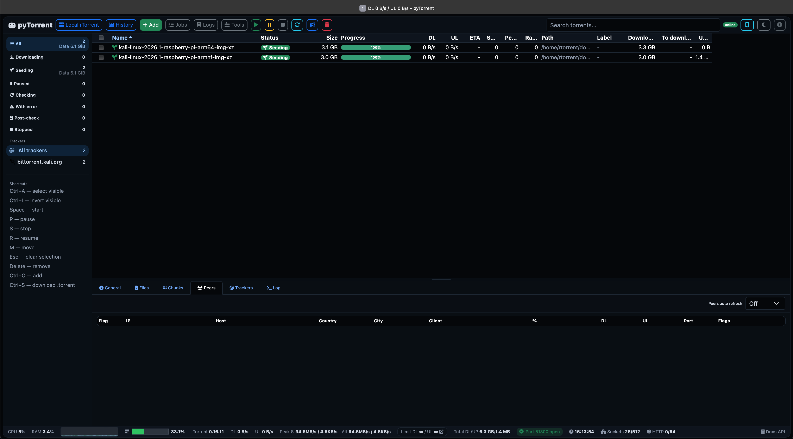

# pyTorrent

Modern single-page web UI for managing rTorrent through SCGI/XML-RPC. pyTorrent focuses on fast live updates, multi-profile support, automation, diagnostics and a clean browser-based workflow inspired by ruTorrent.

> pyTorrent is a controller for your own rTorrent instance. It does not include a BitTorrent engine and does not bypass tracker, copyright or network rules.

## Install pyTorrent only - recommended first path

Use this when rTorrent already exists and only the pyTorrent web UI should be installed. The installer creates the pyTorrent service, virtualenv, `.env`, database and a default rTorrent profile. It does **not** install or reconfigure rTorrent.

Supported systems for `scripts/install_pytorrent_only.sh`:

- Debian / Ubuntu
- RHEL-compatible distributions: RHEL, Rocky Linux, AlmaLinux, CentOS Stream and Fedora-like systems with `dnf` or `yum`
- Arch Linux

One-line install from the repository:

```bash
curl -fsSL https://raw.githubusercontent.com/pyTorrent/pyTorrent/master/scripts/install_pytorrent.sh | sudo bash
```

Local install after cloning:

```bash
git clone https://github.com/pyTorrent/pyTorrent
cd pyTorrent
sudo bash scripts/install_pytorrent_only.sh
```

Non-interactive example for an existing rTorrent SCGI endpoint:

```bash
sudo bash scripts/install_pytorrent_only.sh \
  --yes \
  --port 8090 \
  --scgi-url scgi://127.0.0.1:5000 \
  --auth enable \
  --auth-provider local \
  --auth-user pytorrent \
  --auth-password 'change-this-password'
```

Optional full stack install is described below. Use it only when the server should install and configure rTorrent together with pyTorrent.

## Highlights

- Live torrent table with WebSocket updates and patch-based refreshes.
- Multiple rTorrent profiles, including local and remote hosts.
- Profile-level permissions, user management and API tokens.
- Bulk torrent actions: start, pause, stop, resume, recheck, remove and move.
- Background move/remove jobs with operation history.
- Smart Queue with recent job status and expandable history.
- Download Planner with quiet hours, speed limits, CPU/disk protection and dry-run mode.
- Adaptive Poller with configurable intervals and diagnostics.
- RSS tools, automation rules and cleanup helpers.
- Torrent details: general data, files, peers, trackers and logs.
- Peer GeoIP lookup with MaxMind GeoLite2 database support.
- Dashboard, smart views, global search and notification center.
- OpenAPI docs available from the app.
- Offline frontend assets support for self-hosted deployments.

## Screenshots


## Requirements

### Application

- Python 3.10+
- rTorrent with SCGI/XML-RPC enabled
- Linux server recommended for production

### Python packages

The project uses Flask, Flask-SocketIO, python-dotenv, psutil, geoip2, gunicorn and related runtime dependencies listed in `requirements.txt`.

## Manual development quick start

Clone the repository and run the local development installer:

```bash
git clone https://github.com/pyTorrent/pyTorrent
cd pyTorrent
./install.sh
. .venv/bin/activate
python app.py
```

Default URL:

```text
http://127.0.0.1:8090
```

Copy the example environment file before customizing the app:

```bash
cp .env.example .env
```

## rTorrent SCGI profile

Example pyTorrent profile URL:

```text
scgi://127.0.0.1:5000/RPC2
```

Example rTorrent configuration:

```text
network.scgi.open_port = 127.0.0.1:5000
```

For production, keep SCGI bound to localhost or a private trusted network only.

## Optional stack installer

The repository also includes a stack installer for a clean server. It can install and configure rTorrent + pyTorrent together.

Supported systems:

- Debian / Ubuntu
- RHEL-compatible distributions: RHEL, Rocky Linux, AlmaLinux, CentOS Stream, Fedora-like systems with `dnf` or `yum`
- Arch Linux

After cloning the repository:

```bash
bash scripts/install_stack.sh
```

The default stack install creates:

| Component | Default |
| --- | --- |
| rTorrent user | `rtorrent` |
| rTorrent SCGI | `scgi://127.0.0.1:5000` |
| BitTorrent port | `51300` |
| pyTorrent app dir | `/opt/pytorrent` |
| pyTorrent HTTP port | `8090` |
| pyTorrent service | `pytorrent` |

### Optional one-line full stack install with rTorrent

```bash
curl -fsSL https://raw.githubusercontent.com/pyTorrent/pyTorrent/master/scripts/install_stack.sh \
  | PYTORRENT_PORT=8090 \
    RTORRENT_SCGI_PORT=5000 \
    PYTORRENT_PROFILE_NAME="Local rTorrent" \
    bash
```

## Installer variables

### Bootstrap

| Variable | Default | Description |
| --- | --- | --- |
| `PYTORRENT_REPO_URL` | repository URL | Repository base URL. |
| `PYTORRENT_REPO_BRANCH` | `master` | Branch used by the bootstrap installer. |
| `PYTORRENT_ARCHIVE_URL` | derived | Custom repository archive URL. Required for GitHub one-line install unless the script default is updated. |
| `PYTORRENT_BOOTSTRAP_DIR` | `/tmp/pytorrent-stack-installer` | Temporary bootstrap directory. |
| `PYTORRENT_KEEP_BOOTSTRAP_DIR` | `0` | Set to `1` to keep bootstrap files after install. |

### rTorrent

| Variable | Default | Description |
| --- | --- | --- |
| `RTORRENT_USER` | `rtorrent` | System user used to run rTorrent. |
| `RTORRENT_HOME` | `/home/${RTORRENT_USER}` | Home directory for the rTorrent user. |
| `RTORRENT_BASE_DIR` | `/opt/rtorrent_build` | Build/install directory for source installs. |
| `RTORRENT_SCGI_PORT` | `5000` | Local SCGI port. |
| `RTORRENT_TORRENT_PORT` | `51300` | Incoming BitTorrent port. |
| `RTORRENT_REF` | `v0.16.11` | rTorrent Git tag, branch or commit for source builds. |
| `LIBTORRENT_REF` | `v0.16.11` | libtorrent Git tag, branch or commit for source builds. |
| `RTORRENT_WITH_XMLRPC_C` | `0` | Set to `1` to build with classic xmlrpc-c. |
| `RTORRENT_BUILD_FROM_SOURCE` | distro-specific | On Arch, set to `1` to compile instead of using `pacman`. |
| `RTORRENT_FORCE_CONFIG` | `1` | Overwrite generated `.rtorrent.rc` when supported. |

### pyTorrent

| Variable | Default | Description |
| --- | --- | --- |
| `PYTORRENT_APP_DIR` | `/opt/pytorrent` | Installation directory. |
| `PYTORRENT_PORT` | `8090` | HTTP port. |
| `PYTORRENT_BASE_URL` | `http://127.0.0.1:${PYTORRENT_PORT}` | Base URL used by the API configurator. |
| `PYTORRENT_PROFILE_NAME` | `Local rTorrent` | rTorrent profile created in pyTorrent. |
| `PYTORRENT_API_TOKEN` | empty | Bearer token for authenticated API calls during setup. |
| `PYTORRENT_SERVICE_NAME` | `pytorrent` | systemd service name. |
| `PYTORRENT_RTORRENT_SCGI_URL` | `scgi://127.0.0.1:${RTORRENT_SCGI_PORT}` | SCGI URL saved in the generated profile. |

## Production run

Recommended production command:

```bash
. .venv/bin/activate
gunicorn --worker-class gthread \
  --workers 1 \
  --threads 32 \
  --bind 0.0.0.0:8090 \
  --access-logfile - \
  --error-logfile - \
  wsgi:app
```

pyTorrent uses Flask-SocketIO with threading mode. Multiple Gunicorn workers are not a drop-in replacement unless a Socket.IO message queue such as Redis, RabbitMQ or Kafka is configured.

## systemd

Useful service commands after stack installation:

```bash
systemctl status pytorrent
systemctl status rtorrent@rtorrent.service
journalctl -u pytorrent -f
journalctl -u rtorrent@rtorrent.service -f
```

Application logs may also be available in:

```text
data/logs/
```

## Reverse proxy

Enable proxy header handling only when pyTorrent is behind a trusted proxy:

```env
PYTORRENT_PROXY_FIX_ENABLE=true
PYTORRENT_SESSION_COOKIE_SECURE=true
```

Forward these headers from the proxy:

```text
X-Forwarded-For
X-Forwarded-Proto
X-Forwarded-Host
X-Forwarded-Port
```

If pyTorrent is mounted under a sub-path, also forward:

```text
X-Forwarded-Prefix
```

For HTTPS deployments, set allowed origins explicitly:

```env
PYTORRENT_SOCKETIO_CORS_ALLOWED_ORIGINS=https://pytorrent.example.com
PYTORRENT_API_ALLOWED_ORIGINS=https://pytorrent.example.com
```

## Authentication

pyTorrent supports three authentication providers:

| Provider | Description |
| --- | --- |
| `local` | Built-in pyTorrent login screen with username and password. |
| `tinyauth` | External authentication through Tinyauth and a trusted reverse proxy header. |
| `proxy` | Generic external authentication through a trusted reverse proxy header. |

Enable authentication:

```env
PYTORRENT_AUTH_ENABLE=true
PYTORRENT_AUTH_PROVIDER=local
```

Reset a local user's password:

```bash
. .venv/bin/activate
python -m pytorrent.cli reset-password admin new_password
```

Without the password argument, the command asks interactively:

```bash
python -m pytorrent.cli reset-password admin
```

### API tokens

When authentication is enabled, API requests can use a browser session cookie or a per-user API token. Admin users can generate tokens in:

```text
Tools -> Users -> Generate token
```

Use the token as a bearer token or API key:

```bash
curl -H "Authorization: Bearer pt_xxx" http://127.0.0.1:8090/api/system/status
curl -H "X-API-Key: pt_xxx" http://127.0.0.1:8090/api/system/status
```

Token permissions follow the owning user's role and profile permissions. Revoked tokens stop working immediately.

### External auth through Tinyauth or proxy

Example Tinyauth configuration:

```env
PYTORRENT_AUTH_ENABLE=true
PYTORRENT_AUTH_PROVIDER=tinyauth
PYTORRENT_AUTH_PROXY_USER_HEADER=Remote-User
PYTORRENT_AUTH_PROXY_AUTO_CREATE=true
PYTORRENT_AUTH_PROXY_AUTO_CREATE_ROLE=admin
PYTORRENT_AUTH_PROXY_AUTO_CREATE_PERMISSION=rw
```

Example generic proxy configuration:

```env
PYTORRENT_AUTH_ENABLE=true
PYTORRENT_AUTH_PROVIDER=proxy
PYTORRENT_AUTH_PROXY_USER_HEADER=X-Forwarded-User
PYTORRENT_AUTH_PROXY_AUTO_CREATE=true
PYTORRENT_AUTH_PROXY_AUTO_CREATE_ROLE=user
PYTORRENT_AUTH_PROXY_AUTO_CREATE_PERMISSION=rw
```

`rw` is accepted as an alias for `full`. Admin users can access all profiles.

Do not use auth bypass on public hostnames. Limit bypass hosts to trusted private addresses only:

```env
PYTORRENT_AUTH_BYPASS_HOSTS=10.11.1.11:8090,10.11.1.11
PYTORRENT_AUTH_BYPASS_USER=admin
```

## GeoIP

The installer can download the GeoLite2 City database to:

```text
data/GeoLite2-City.mmdb
```

Manual download:

```bash
./scripts/download_geoip.sh
```

Configure the database path:

```env
PYTORRENT_GEOIP_DB=data/GeoLite2-City.mmdb
```

## OpenAPI

OpenAPI documentation is available at:

```text
/docs
/api/openapi.json
```

The API includes profile management, torrent actions, preferences, port checks, system status, planner, poller, RSS, backups and diagnostics endpoints.

## Configuration reference

Common environment variables:

```env
PYTORRENT_SECRET_KEY=change-me
PYTORRENT_DB_PATH=data/pytorrent.sqlite3
PYTORRENT_HOST=0.0.0.0
PYTORRENT_PORT=8090
PYTORRENT_DEBUG=0
PYTORRENT_POLL_INTERVAL=1
PYTORRENT_WORKERS=16
PYTORRENT_USE_OFFLINE_LIBS=true
PYTORRENT_LOG_ENABLE=false
PYTORRENT_LOG_DIR=data/logs
```

Retention settings:

```env
PYTORRENT_TRAFFIC_HISTORY_RETENTION_DAYS=90
PYTORRENT_JOBS_RETENTION_DAYS=30
PYTORRENT_SMART_QUEUE_HISTORY_RETENTION_DAYS=30
PYTORRENT_LOG_RETENTION_DAYS=30
```

Database maintenance:

```env
PYTORRENT_DB_VACUUM_ENABLE=true
PYTORRENT_DB_VACUUM_EVERY_SECONDS=86400
PYTORRENT_DB_VACUUM_MIN_FREE_MB=512
PYTORRENT_DB_VACUUM_MIN_FREE_RATIO=0.25
```

See `.env.example` for the full list.

## Troubleshooting

### Service does not start

```bash
journalctl -u pytorrent -n 100 --no-pager
systemctl status pytorrent
```

### rTorrent connection fails

Check that rTorrent exposes SCGI locally and that the pyTorrent profile uses the same port:

```text
scgi://127.0.0.1:5000/RPC2
```

### External auth creates users without profiles

Use admin auto-create mode:

```env
PYTORRENT_AUTH_PROXY_AUTO_CREATE_ROLE=admin
```

Or grant read-write profile permissions to non-admin users:

```env
PYTORRENT_AUTH_PROXY_AUTO_CREATE_ROLE=user
PYTORRENT_AUTH_PROXY_AUTO_CREATE_PERMISSION=rw
```

### Socket.IO badge stays offline behind reverse proxy

Forward the same authenticated user header to all pyTorrent paths, including `/socket.io/`:

```nginx
auth_request_set $auth_user $upstream_http_remote_user;
proxy_set_header Remote-User $auth_user;
```

### Build logs

Source-build installers write logs to:

```text
/var/log/pytorrent-installer
```

Enable verbose installer output:

```bash
PYTORRENT_DEBUG_INSTALL=1 bash scripts/install_stack.sh
```

## Security notes

- Do not expose rTorrent SCGI directly to the public internet.
- Use HTTPS and authentication for remote access.
- Set a strong `PYTORRENT_SECRET_KEY` before production use.
- Review auth bypass settings before publishing or deploying.
- Keep `.env` out of Git. Use `.env.example` for public defaults.

## Development

```bash
. .venv/bin/activate
python app.py
```

Run a quick Python compile check:

```bash
python -m compileall pytorrent app.py wsgi.py
```

Download offline frontend assets when needed:

```bash
python scripts/download_frontend_libs.py
```

## Project structure

```text
pytorrent/                 Application package
pytorrent/routes/          Flask routes and API modules
pytorrent/services/        rTorrent, planner, queue and helper services
pytorrent/static/          Frontend JavaScript and CSS
pytorrent/templates/       HTML templates
scripts/                   Installers and maintenance tools
systemd/                   systemd service files
data/                      Runtime data directory
```

## License

AGPL-3